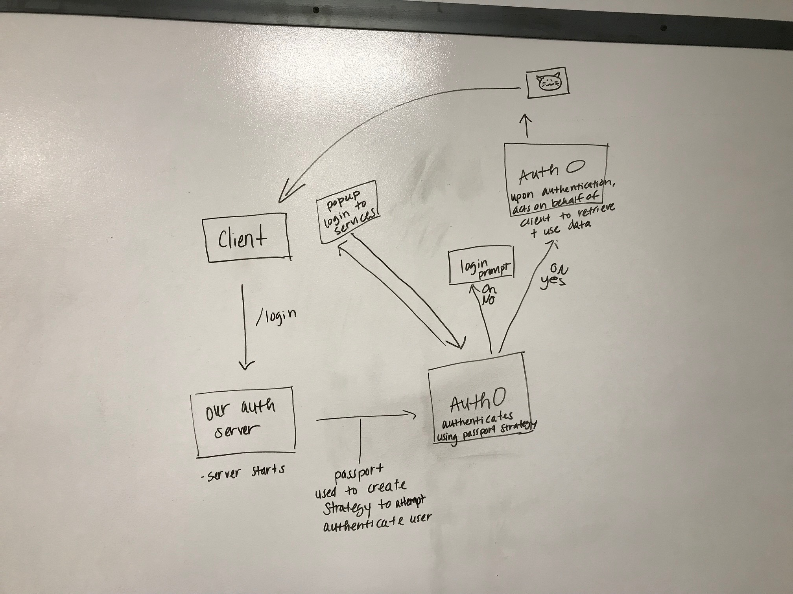

 LAB
=================================================

## Project Name: OAUTH - Auth0

### Author: Heather Cherewaty, Brent Woodward, & Jacob Anderson

### Links and Resources
* [repo](https://github.com/hcherewaty/17-oauth)
<!-- * [back-end demo](http://xyz.com)  -->
* [front-end demo](https://superdog-app1.herokuapp.com/)

#### Documentation
* [assessment report](./REPORT.md)

### Modules
#### `auth/middleware/oauth/{filename}.js`
* List any usage/requirement notes in here

##### Implementation Notes  
* Required ENV Variables:  AUTH0_CLIENT_ID, AUTH0_CLIENT_SECRET, AUTH0_DOMAIN
* Accessing the server
* OAuth Link 

#### UML

